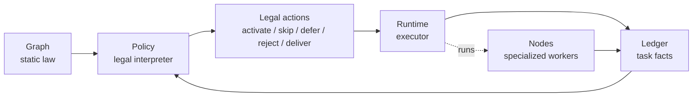
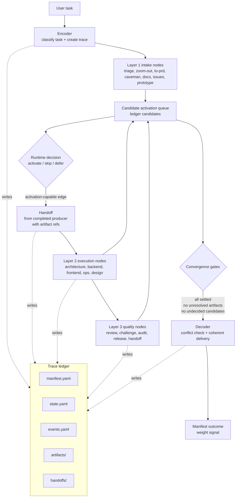
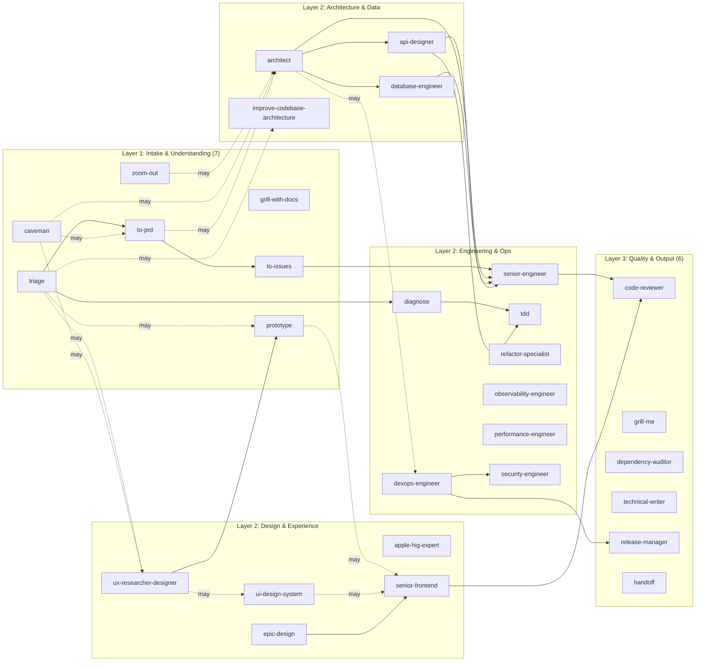
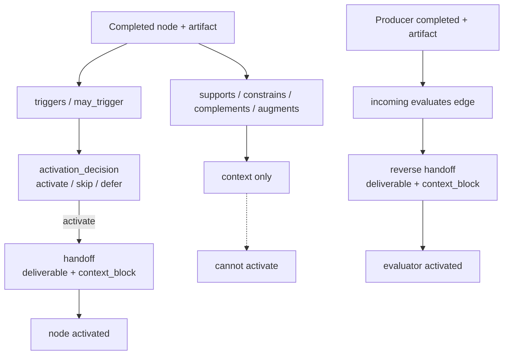
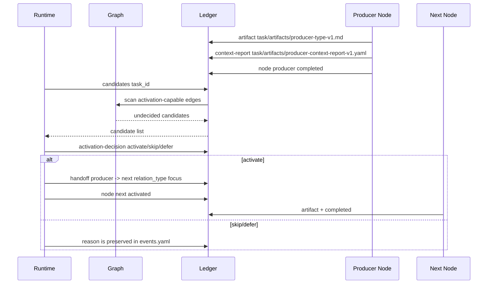
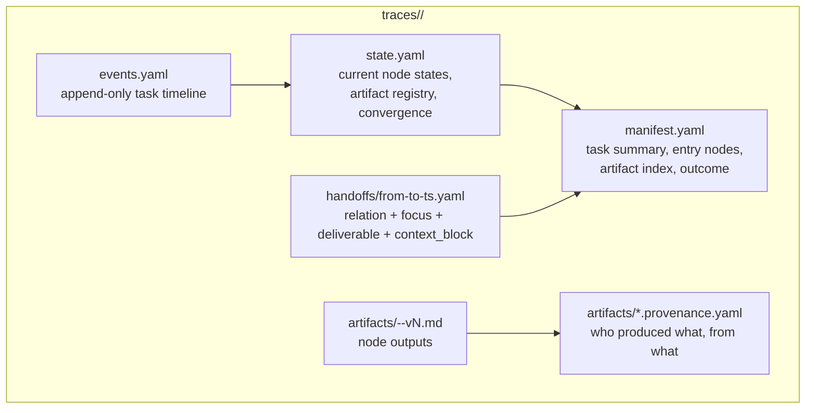
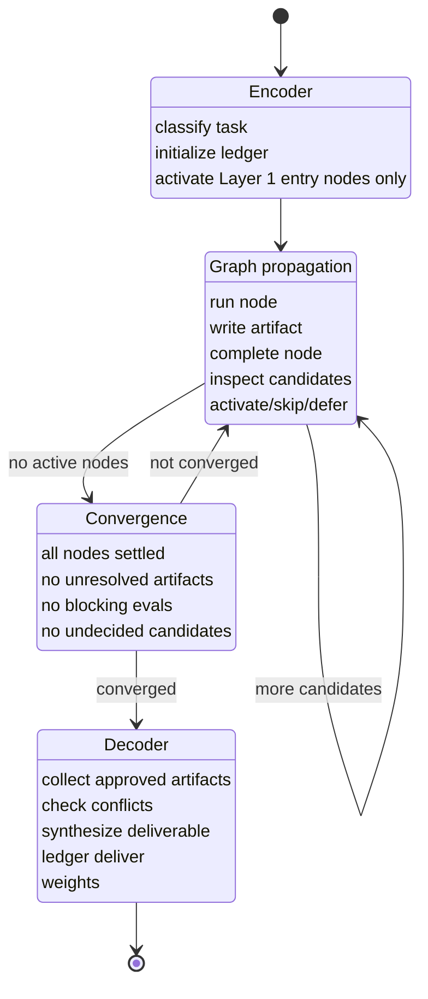

# Silicon Org Harness Engineering

Silicon Org is a runtime harness for constraining large-model work. It does not
trust a model to "remember the process". It turns the process into files,
typed graph edges, ledger writes, activation gates, artifact contracts, and
delivery checks.

The aim is simple: a model may reason, but the harness decides when that
reasoning is allowed to become graph movement.

---

## Five Concepts

Silicon Org should be understood through five concepts only:

| Concept | Role | What belongs here |
|---------|------|-------------------|
| Graph | Static law: what roles exist, what edges mean, and which movements are legal | `ontology/nodes.yaml`, `ontology/relations.yaml`, `ontology/relation_types.yaml` |
| Ledger | Durable facts for one task: what happened, what artifacts exist, what decisions were recorded | `traces/<task_id>/manifest.yaml`, `state.yaml`, `events.yaml`, `artifacts/`, `handoffs/` |
| Policy | The judge: interprets Graph + Ledger and returns legal actions | legality rules in `tools/policy.py`; scheduler advice in `tools/scheduler.py`; writes still go through `tools/ledger.py` |
| Runtime | The executor: runs nodes, records decisions, follows Policy, and delivers only after convergence | `org/RUNTIME.md`, `org/ENCODER.md`, `org/DECODER.md` |
| Learning | The feedback layer: turns traces into conservative updates | `learning/`, `traces/index_by_role.yaml`, `traces/index_by_relation.yaml` |

The `ontology/` directory name is just the current storage path for Graph
files. Conceptually, there is no separate "ontology entity" beside Graph.
Likewise, `state.yaml` is part of the Ledger. It is not a second runtime state
system.

This diagram is an abridged activation-capable backbone, not the full
112-edge graph.



This keeps the language small:

- Graph says what could be legal.
- Ledger says what is true in this task.
- Policy says what is legal now.
- Runtime does the legal action and writes the result back to the Ledger.
- Learning updates priors from accumulated traces.

---

## One-Page Map



The Runtime is not the worker. It is the execution substrate. Nodes do the work;
the Runtime moves information through the graph and refuses invalid movement.
LangGraph is treated as an optional execution substrate under this Runtime
boundary. It may provide checkpointing and durable execution when installed,
but it does not own Graph legality or Ledger truth.

---

## What "Harness Engineering" Means Here

Harness engineering is the discipline of surrounding a large model with enough
structure that its useful judgment is preserved while its common failure modes
are blocked.

In Silicon Org, the harness has six surfaces:

| Surface | What it constrains | Local files |
|---------|--------------------|-------------|
| Role harness | What a node is allowed to do, produce, and hand off | `org/registry/*.md` |
| Graph nodes and edges | Which nodes can influence, activate, review, or constrain others | `ontology/nodes.yaml`, `ontology/relations.yaml` |
| Graph edge types | What each edge means; activation vs context vs evaluation | `ontology/relation_types.yaml` |
| Ledger facts | What actually happened, in order, with artifacts and provenance | `traces/<task_id>/` |
| Runtime protocol | The state machine that moves through encode, propagate, converge, decode | `org/RUNTIME.md` |
| Tool gates | Hard checks that reject invalid graph movement | `tools/policy.py`, `tools/ledger.py`, `tools/spawn.py` |

The model can still make judgments. It just has to turn them into explicit,
auditable actions: artifacts, handoffs, activation decisions, approvals, and
deliveries.

---

## Graph Shape

Silicon Org currently has 41 nodes and 152 typed edges.



This graph is intentionally not a fixed workflow. Every task walks a different
path. The graph supplies candidates; the Runtime records why each candidate was
activated, skipped, or deferred.

---

## Relation Semantics

Not every edge can activate a node.

| Relation | Can activate? | Direction | Meaning |
|----------|---------------|-----------|---------|
| `triggers` | Yes | source -> target | Source completion makes target a candidate when probability is high enough |
| `may_trigger` | Yes, conditionally | source -> target | Source completion makes target a conditional candidate |
| `evaluates` | Yes, reversed for handoff | producer -> evaluator | Once target output exists, evaluator may review it |
| `supports` | No | context only | Source output should be read if target is activated by another edge |
| `constrains` | No | context only | Source limits target's design space |
| `complements` | No | context only | Combined outputs are better, but neither starts the other |
| `augments` | No | context/output extension | Source adds to target's output |

This distinction is load-bearing. A common model failure is to see "A supports
B" and start B. The ledger now rejects that. A support edge can enrich an
already-activated node; it cannot create activation.



---

## Activation Protocol

The Runtime never jumps directly from "I think we need X" to "X is activated".

It must pass this sequence:



A non-entry activation requires:

1. A completed predecessor.
2. At least one registered artifact from that predecessor.
3. An activation-capable relation.
4. A handoff that matches that relation and carries both `deliverable` and
   `context_block`.
5. An activation decision event.

If any part is missing, `tools/policy.py` refuses the activation before
`tools/ledger.py` writes state.

---

## Ledger As Task Facts

The trace folder is the durable fact record of a task. `state.yaml` is inside
this record. That means "runtime state" should not become a separate concept in
the architecture; if it matters for execution, it must be visible in the
Ledger.



The ledger prevents three dangerous shortcuts:

- "I did the work, trust me." No: register an artifact.
- "I know the next node." No: record an activation decision and handoff.
- "The artifact ref is enough." No: every handoff also carries the compressed
  context block inherited from prior handoffs.
- "We are done." No: deliver only after candidate and artifact gates are clear.

### Context-Chain Handoffs

Every downstream handoff is two-part:

1. `deliverable`: the producer's direct artifacts and compact metadata.
2. `context_block`: a compressed block containing prior handoff digests and
   inherited artifact refs used by the producer.

This restores the original block-chain-like design: a downstream node receives
the current document plus a compact summary of the context that led to it. The
receiver does not have to rediscover the whole upstream trace, and the Runtime
can still audit the chain through `context_digest`.

---

## Runtime Phases



---

## Guardrails

| Failure mode | Guardrail |
|--------------|-----------|
| Runtime activates Layer 2/3 as entry | `ledger node ... --set-entry` rejects non-Layer-1 roles |
| Runtime starts a node without a predecessor | Non-entry activation requires valid handoff |
| Runtime starts a node through `supports` | Activation only accepts `triggers`, `may_trigger`, or reverse `evaluates` |
| Runtime completes node without artifact | `node completed` requires producer artifact |
| Runtime completes node without context compression | `node completed` requires a valid Context Compression Report |
| Runtime forgets eligible graph edges | `ledger candidates` lists undecided candidates |
| Runtime ignores eligible graph edges | `ledger validate` fails on undecided candidates |
| Runtime declares success with draft artifacts | `ledger deliver success` rejects draft/under_review artifacts |
| Runtime delivers without outcome | `ledger deliver` writes `manifest.outcome` and `timestamp_end` |
| Runtime loses handoff history | `ledger handoff` appends `manifest.handoff_trail` |
| Weight learning receives no signal | `ledger deliver` sets outcome used by `ledger weights` |

These are harness rules, not suggestions.

---

## Model Policy

Silicon Org does not hard-code concrete model IDs into nodes. The Graph
describes roles and structure, not vendor-specific model names.

Default behavior:

- Use the Runtime's current/default model.
- Show the recommended profile in `tools/spawn.py preview`.
- Allow optional user overrides through `org/models.local.yaml`.

Recommended profiles:

| Layer | Profile |
|-------|---------|
| Runtime | strongest available reasoning model |
| Layer 1 | fast/low-latency model with adequate reasoning |
| Layer 2 | balanced coding/design model |
| Layer 3 | strongest review/reasoning model available |

This preserves portability across Claude, Codex, local models, and future
agent runtimes.

---

## Learning Kernel

The moat is not only the current graph. It is the accumulated experience that
teaches the graph how to route better next time.

Current learning is intentionally conservative:

- `learning/signals.py` converts manifest outcomes into structured role and
  relation signals.
- `ledger weights` writes signal value, confidence, source, and detail into the
  role/relation indices, and writes non-auto-applied review proposals into
  `traces/index_learning_proposals.yaml`.
- `learning/weight_update.py` contains bounded EMA helpers for human-reviewed
  graph weight proposals.

Human-reviewed learning proposals may cover:

1. edge weights by task context and outcome,
2. activation policy by observed usefulness of optional nodes,
3. model routing by cost/latency/quality,
4. graph corrections for missing edges, weak edges, and missing roles.

The Context Block is the guard against forgetting why these updates exist.
Every new task manifest stores a digest of `org/CONTEXT_BLOCK.md`.

Learning proposals are not policy. They are structured evidence for review:
verification gaps, convergence gate breaches, and repeated or high-cost skips.
Only an explicit code/graph change, reviewed and audited, can turn a proposal
into Policy.

---

## Example: Why `supports` Cannot Activate

Bad execution:

```bash
# Assume to-prd has already registered its artifact and Context Compression Report.
python tools/ledger.py handoff "$TASK" to-prd architect supports "requirements context"
python tools/ledger.py node "$TASK" architect activated
```

Why it fails:

`supports` says "if architect is activated, this is useful input." It does not
say "architect should run." The Runtime must find an activation-capable edge:

```bash
# Assume to-prd has already registered its artifact and Context Compression Report.
python tools/ledger.py handoff "$TASK" to-prd architect may_trigger "architecture required"
python tools/ledger.py node "$TASK" architect activated
```

The difference matters because edge weights are learning signals. If every
context edge can secretly behave like an activation edge, the graph stops being
the organization and becomes decoration.

---

## Example: Evaluation Runs Backward

The Graph declares:

```yaml
- from: grill-me
  to: architect
  type: evaluates
```

That reads as "grill-me evaluates architect." But activation cannot happen until
architect has produced something. Therefore the handoff flows from producer to
evaluator:

```bash
# Assume architect has already registered its artifact and Context Compression Report.
python tools/ledger.py handoff "$TASK" architect grill-me evaluates "review architecture"
python tools/ledger.py node "$TASK" grill-me activated
```

This fixes the temporal contradiction where an evaluator starts before the
artifact it is supposed to review exists.

---

## Operating Commands

Start a task:

```bash
TASK_ID="task-$(date +%Y%m%dT%H%M%S)-$(head -c4 /dev/urandom | xxd -p)"
python tools/ledger.py init "$TASK_ID" feature "one sentence summary"
python tools/ledger.py node "$TASK_ID" triage activated --set-entry
```

After a node produces output:

```bash
python tools/ledger.py artifact "$TASK_ID" triage analysis artifacts/triage-analysis-v1.md
python tools/ledger.py context-report "$TASK_ID" triage artifacts/triage-context-report-v1.yaml
python tools/ledger.py node "$TASK_ID" triage completed
python tools/ledger.py candidates "$TASK_ID"
```

Activate a candidate:

```bash
python tools/ledger.py handoff "$TASK_ID" triage to-prd triggers "turn request into requirements"
python tools/ledger.py node "$TASK_ID" to-prd activated
```

Skip a candidate:

```bash
python tools/ledger.py activation-decision "$TASK_ID" triage prototype may_trigger skip "feasibility is already known"
```

Validate and deliver:

```bash
python tools/ledger.py validate "$TASK_ID"
python tools/ledger.py artifact-status "$TASK_ID" code-reviewer-review-v1 approved
python tools/ledger.py deliver "$TASK_ID" success "decoder summary"
python tools/ledger.py weights "$TASK_ID"
```

---

## Design Principle

Silicon Org is not "many prompts". It is an execution harness:

- prompts define local role behavior
- Graph edges define admissible movement
- Ledger writes define durable truth
- Policy converts Graph + Ledger into legal next actions
- artifacts define handoff material
- validators define what the Runtime cannot fake
- Decoder writes the outcome that graph learning depends on

That is the core of the design: the model may improvise inside a room, but it
does not get to move the walls.
