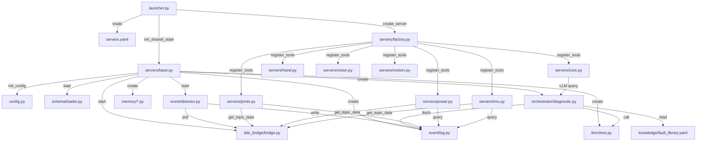

# Architecture Decision Record: manastone-diag v0.4 Refactoring

**ADR-001** | Task: refactor and optimize manastone-diag  
**Date**: 2026-05-26 | **Status**: Proposed  
**Predecessor artifact**: zoom-out-output-v1.md (module map + 8 issues identified)

---

## Context

manastone-diag has evolved from v0.1 (single-server Gradio app) to v0.4 (7 MCP servers with shared AppState). The zoom-out analysis identified eight concrete issues:

1. `ui.py` is stale — references deleted modules (`resources.joints`, `mock_scenarios`)
2. Hardcoded thresholds in `power.py` and `imu.py` duplicate schema-driven FieldRule
3. Server boilerplate duplication — 7 files share ~15 identical lines
4. Motion server typo: `ensure_aware` → `ensure_ascii`
5. `config.py` global singleton with side effects (dotenv loading on first `get_config()`)
6. Orchestrator `_find_yaml_skills()` has hardcoded `kw_map` duplicating YAML knowledge
7. No DI — global singletons (`_shared`, `_config`) limit testability
8. Real DDS unimplemented (feature work, out of scope for this refactor)

The system is deployed on a Unitree G1 Orin NX, runs fully offline, serves external MCP clients (Claude Desktop, Cursor) over SSE, and must remain backward-compatible at the MCP tool contract level.

---

## Load-Bearing Decisions

### Decision 1: Remove `ui.py` from the package

**Choice**: Delete `src/manastone_diag/ui.py` and remove the `manastone-ui` entry point from `pyproject.toml`.

**Rationale**: The v0.4 architecture delivers value through MCP servers, not a Gradio web UI. The `ui.py` file references deleted modules and cannot run. Keeping dead code misleads future maintainers about the system's actual interface surface. The `.venv` already includes Gradio, so removing the code but keeping the dependency has marginal space savings — but the removal eliminates confusion.

**Alternatives considered**:
- *Rewrite ui.py for v0.4* — Rejected. Gradio adds a second UI paradigm (web page) alongside MCP SSE. The MCP protocol is the system's interface; maintaining a parallel UI duplicates every tool. If a web dashboard is desired later, it should be a separate project that calls MCP tools, not embedded in the diagnostic package.
- *Keep as-is with a deprecation warning* — Rejected. Already done in `server.py`. The `ui.py` can't even import its dependencies; a warning won't fire.

**Consequences**:
- `manastone-ui` CLI command disappears (breaking, but it was already broken)
- `gradio` dependency can become optional or be removed
- Clearer: one interface paradigm (MCP) instead of two

---

### Decision 2: Extract shared server factory — do NOT create a base class

**Choice**: Create a `servers/factory.py` module with a `create_standard_server()` function that encapsulates the common lifespan + `main()` pattern. Each server module calls it with its own `register_tools(mcp)` callback.

**Rationale**: The 7 servers share an identical pattern: FastMCP constructor → `_lifespan` using `init_shared_state` → tool registration → `main()`. A base class would force all servers into the same inheritance hierarchy, making future servers with different lifecycle needs (e.g., WebSocket transport) harder. A factory function with a callback is looser coupling.

**Alternatives considered**:
- *Abstract base class with `register_tools()` method* — Rejected. Over-abstracting for 7 servers. Inheritance makes the pattern rigid; composition keeps it flexible.
- *Keep boilerplate as-is* — Rejected. Duplication accumulates drift (e.g., the motion.py typo).

**Consequences**:
- Each server reduces from ~30 lines of scaffolding to ~5 lines
- Fixing a pattern bug (like a new env var) requires one edit, not seven

---

### Decision 3: Treat server-tool thresholds as display helpers, not detection duplicates

**Choice**: Keep `power.py`'s `level()` helper (voltage_level, soc_level, temp_level) and `imu.py`'s `tilt_level()` as UI convenience annotations on MCP tool output. They are NOT event detection — that remains exclusively in `EventDetector` via `FieldRule`. Add a comment in both files clarifying the boundary.

**Rationale**: MCP tool output enrichment (e.g., labeling a voltage as "warning" at 46V) is a user-facing convenience. It must not be confused with the EventDetector's schema-driven threshold evaluation, which produces persistent SemanticEvents. Removing these helpers entirely would make tool output less readable (raw numbers only). The real problem is ambiguity about which thresholds are authoritative. Explicit comments solve this.

**Alternatives considered**:
- *Read thresholds from schema in server tools too* — Rejected. Adds import complexity for a display convenience. The schema is the detector's domain; tools are query interfaces.
- *Remove all threshold logic from servers* — Rejected. Degrades tool output readability.

**Consequences**:
- No behavior change; only documentation added
- If thresholds change in schema, servers won't automatically update — acceptable because display helpers are non-authoritative

---

### Decision 4: Make `get_config()` pure — move dotenv loading to explicit call

**Choice**: Add an explicit `init_config()` function that loads dotenv and creates Config. `get_config()` becomes a pure accessor that raises if called before `init_config()`. Call `init_config()` once in `launcher.py` and `servers/base.py:init_shared_state()`.

**Rationale**: The current `get_config()` has the side effect of loading dotenv on first call. This makes it impossible to test with a custom Config, and it couples config access to filesystem I/O. Separating initialization from access makes the dependency explicit and testable.

**Alternatives considered**:
- *Full DI container* — Rejected for this refactor scope. The system is a single-process diagnostic agent; a DI framework adds complexity without proportional benefit.
- *Leave as-is* — Rejected. The side effect violates principle of least surprise and blocks testing.

**Consequences**:
- `init_config()` must be called before any `get_config()` — enforced by RuntimeError
- `set_config()` remains available for tests
- One-line change at each call site (add `init_config()` at startup)

---

### Decision 5: Move orchestrator keyword map into `fault_library.yaml`

**Choice**: Add an optional `keywords` list field to each fault entry in `fault_library.yaml`. The orchestrator reads these instead of the hardcoded `kw_map` dict.

**Rationale**: The hardcoded `kw_map` duplicates information that already conceptually lives in the YAML (symptoms, name). When a new fault is added to the YAML, the keyword map must be manually updated in two places — a maintenance hazard. Moving keywords into the YAML makes the knowledge base self-contained.

**Alternatives considered**:
- *Remove keyword mapping entirely, rely only on symptom overlap scoring* — Rejected. Hard-trigger keywords provide precision that fuzzy overlap can't (e.g., "lidar" → FK-004 specifically, not any fault mentioning sensors).
- *Keep keywords in code but generate from YAML symptoms automatically* — Considered. Would require NLP tokenization of Chinese symptom text. Out of scope for this refactor.

**Consequences**:
- `fault_library.yaml` schema gains optional `keywords: [string]` field
- Orchestrator `_find_yaml_skills()` becomes simpler (no inline `kw_map`)
- Existing YAML must be updated with keyword lists (one-time migration)

---

### Decision 6: Accept global singletons for now — document the pattern

**Choice**: Keep `_shared` (AppState) and `_config` (Config) as module-level globals. Add a module docstring to `servers/base.py` and `config.py` explaining the singleton pattern and why it's appropriate for this context. Do not introduce a DI framework.

**Rationale**: This is a single-process diagnostic agent running on an embedded device (Orin NX). There is exactly one AppState, one DDSBridge, one EventLog. The global singleton accurately models reality. Introducing a DI container to manage four singletons would add abstraction overhead without enabling any currently-needed use case (like multi-robot or test fixtures). If testing needs arise, the `set_config()` escape hatch and `init_shared_state()` idempotency already support test setup.

**Alternatives considered**:
- *Inject dependencies through FastMCP lifespan context* — Partially done already (AppState flows through lifespan). But tool functions access `get_shared_state()` directly because FastMCP's `Context` parameter is optional and not used in all tools. Full injection would require changing every tool signature — high churn, low value.
- *Introduce a lightweight DI (e.g., `dependency-injector`)* — Rejected. Adds a dependency, learning curve, and indirection for a 4-singleton system.

**Consequences**:
- No structural change to server tools
- Module docstrings serve as design documentation
- Future multi-robot support would require breaking the singleton — but that's a different problem

---

### Decision 7: Fix motion.py typo immediately (trivial, high confidence)

**Choice**: Change `ensure_aware=False` to `ensure_ascii=False` in `servers/motion.py:106`.

**Rationale**: This is a copy-paste error that would cause a runtime `TypeError` if the motion server is ever enabled and called. Zero risk, immediate benefit.

**Consequences**: None. Pure bugfix.

---

## Implementation Sequence (Incremental)

These decisions can be implemented independently, in any order. No step depends on another:

| Order | Action | Files affected | Risk |
|-------|--------|---------------|------|
| 1 | Fix motion.py typo | 1 file | None |
| 2 | Add docstrings to config.py + base.py | 2 files | None |
| 3 | Make config.py init explicit | config.py + launcher.py + base.py | Low |
| 4 | Extract server factory | 7 server files + 1 new factory.py | Medium |
| 5 | Move keywords into fault_library.yaml | fault_library.yaml + orchestrator/diagnostic.py | Low |
| 6 | Remove ui.py + gradio dependency | ui.py + pyproject.toml | Low |
| 7 | Add threshold boundary comments to power.py, imu.py | 2 files | None |

---

## Target Architecture (Post-Refactor)



## Failure Modes

| Component unavailable | Effect |
|---|---|
| DDSBridge stops | EventDetector goes stale → active warnings become outdated; MCP tools return cached/no data |
| EventLog (SQLite) | Append failures logged; tools returning event history return empty; active warnings frozen |
| EventDetector crashes | No new SemanticEvents; existing events still queryable; system_status still reports last-known state |
| LLM unavailable | Orchestrator falls back to rule-based response; `diagnose` tool still functional but less nuanced |
| Schema file missing | `init_shared_state()` raises at startup; launcher exits with error |
| Individual server crashes | In single-process mode: all servers die (shared asyncio loop). Mitigation: launcher could wrap each server in try/except and log, but true isolation requires multi-process deployment (out of scope) |

---

## Completion Report

```yaml
completion_report:
  what_was_done: "Produced 7 architecture decisions with rationale and alternatives for manastone-diag v0.4 refactoring. Designed incremental implementation sequence with no inter-step dependencies. Produced target architecture diagram (Mermaid). Identified failure modes."
  key_decisions:
    - decision: "Remove ui.py (stale v0.1 code with deleted dependencies)"
      rationale: "Cannot run; misleads maintainers; MCP is the single interface paradigm"
    - decision: "Extract server factory function (not base class)"
      rationale: "Composition over inheritance; 7 identical patterns need deduplication without rigid hierarchy"
    - decision: "Keep server-tool thresholds as display helpers with documented boundary"
      rationale: "User-facing convenience ≠ authoritative detection; EventDetector remains single source of truth"
    - decision: "Make get_config() pure — separate init from access"
      rationale: "Side-effect-free access enables testing; dotenv loading becomes explicit startup step"
    - decision: "Move orchestrator keywords into fault_library.yaml"
      rationale: "Eliminates code/YAML duplication; knowledge base becomes self-contained"
    - decision: "Accept global singletons with documentation"
      rationale: "Models reality (single-process, single-robot); DI framework overhead unjustified for 4 objects"
  handoff_focus:
    - "Implement server factory (servers/factory.py) — highest impact deduplication"
    - "Apply config.py init/access separation at launcher and base.py"
    - "Migrate keywords from orchestrator kw_map into fault_library.yaml"
    - "Delete ui.py and clean up pyproject.toml"
    - "Fix motion.py typo (trivial, do first)"
    - "Add threshold boundary documentation to power.py and imu.py"
  open_questions:
    - "Should gradio dependency be removed from pyproject.toml or moved to optional?"
    - "Do any external MCP clients depend on manastone-ui entry point?"
  known_constraints:
    - "Must stay offline-friendly (no cloud dependency)"
    - "MCP tool contracts must remain backward compatible"
    - "Python 3.10+ required"
    - "Single-process deployment (Orin NX resource constraints)"
    - "7 implementation steps are independent — can be parallelized"
    - "Real DDS bridge implementation is out of scope for this refactor"
  iteration_context: null
```
