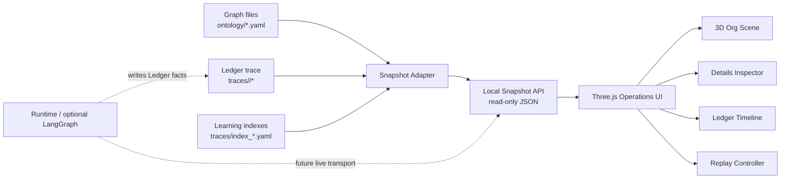
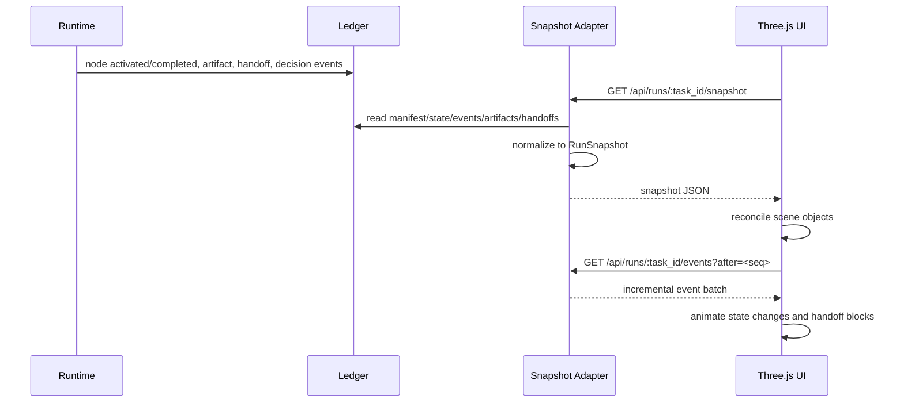

# Architecture: Local Three.js Silicon Org Operations Visualizer

## Context

The requested system is a local frontend that makes Silicon Org visible while it runs. It must show the organization graph, policy decisions, ledger facts, runtime activity, learning signals, handoff block movement, and the contents of each handoff block. The visualizer must not become a second source of truth. It is a projection of Graph files and Ledger traces.

Upstream caveman analysis reduced the product to one operational outcome: "What is happening? Why? What evidence exists?" The design below keeps that outcome central.

## Decision

Build the visualizer as a local read-only operations surface with three layers:

1. Snapshot adapter/server: reads `ontology/`, `traces/<task_id>/`, and learning indexes; emits normalized JSON snapshots.
2. Three.js frontend: renders the organization as a deterministic 3D scene with inspectors, timeline, and replay controls.
3. Live update boundary: starts with polling and event replay; later upgrades to SSE/WebSocket or LangGraph event streaming without changing the frontend schema.

Ledger remains the source of truth. LangGraph, if present, is only an optional execution substrate whose events must be written or mirrored into the same Ledger-derived snapshot model.

## Load-Bearing Principles

- Graph is law: nodes, edges, edge types, weights, and legal reachability come from `ontology/`.
- Ledger is fact: manifests, state, events, artifacts, handoffs, context blocks, and outcomes come from `traces/`.
- Policy is visible: activation candidates, skipped/deferred decisions, blocked gates, and convergence blockers must be rendered as first-class objects.
- Runtime is observable but not authoritative: running status is shown only when it appears in Ledger events/state or the local runtime feed is explicitly marked ephemeral.
- Learning is conservative: learned weight deltas and proposals are shown as suggestions/history, not as direct Policy overrides.
- Handoff blocks are objects, not just animations: each transfer carries deliverable refs plus compressed context-block data and digest chain.

## System Shape



## Frontend and Server Choice

Use a Vite + TypeScript + Three.js frontend and a small local read-only snapshot server.

Recommended initial structure:

```text
visualizer/
  package.json
  src/
    main.ts
    scene/
      layout.ts
      nodes.ts
      edges.ts
      handoffBlocks.ts
      zones.ts
    data/
      client.ts
      schema.ts
      replay.ts
    panels/
      Inspector.ts
      Timeline.ts
      Filters.ts
  public/
tools/
  visualizer_snapshot.py
```

Rationale:

- Vite keeps the frontend lightweight and fast to iterate.
- Three.js is appropriate because the product is spatial: layered agents, typed edges, moving handoff blocks, policy gates, and ledger planes.
- The snapshot adapter should live outside the frontend so raw YAML parsing and trace-version tolerance stay in Python, close to the existing tools.
- The server is read-only in v1. No UI mutation of Graph, Policy, Ledger, or learning data.

Server implementation options:

- v1: `tools/visualizer_snapshot.py serve --task-id <task_id> --port 5179`, using Python stdlib or a very small dependency surface.
- v1 fallback: `tools/visualizer_snapshot.py export --task-id <task_id> --out visualizer/public/snapshot.json` for static replay.
- future: SSE/WebSocket endpoint from the same adapter process.

## Data Flow



Normalization rules:

- Parse Graph once per reload from `ontology/nodes.yaml`, `ontology/relations.yaml`, and relation type metadata if present.
- Parse Ledger repeatedly from `manifest.yaml`, `state.yaml`, `events.yaml`, `artifacts/*.provenance.yaml`, and `handoffs/*.yaml`.
- Prefer explicit Ledger state over inferred state.
- If an object is malformed, include it with `status: "invalid"` and an error entry rather than hiding it.
- Preserve source refs on every normalized object so the inspector can point back to evidence.

## Snapshot API

The API is local, unauthenticated by default, and read-only. It should bind to `127.0.0.1` unless explicitly configured otherwise.

Endpoints:

```text
GET /api/org
GET /api/runs
GET /api/runs/:task_id/snapshot
GET /api/runs/:task_id/events?after=<sequence>
GET /api/runs/:task_id/artifacts/:artifact_id
GET /api/health
```

Response model:

```ts
type RunSnapshot = {
  schema: "silicon_org.visualizer.snapshot.v1";
  generatedAt: string;
  graph: OrgGraph;
  run: RunView;
  policy: PolicyView;
  ledger: LedgerView;
  learning: LearningView;
  errors: SnapshotError[];
};
```

## Core Schema

### Nodes

```ts
type OrgNode = {
  id: string;
  title: string;
  layer: 1 | 2 | 3 | "meta" | null;
  domain: string | null;
  carriesSoul: boolean;
  skillRef: string | null;
  registryRef: string;
  modelProfile?: string;
  status: NodeStatus;
  positionHint: {
    zone: "intake" | "execution" | "quality" | "meta" | "system";
    ring: number;
    order: number;
  };
  sourceRefs: string[];
};

type NodeStatus =
  | "idle"
  | "candidate"
  | "activated"
  | "running"
  | "completed"
  | "skipped"
  | "deferred"
  | "failed"
  | "approved"
  | "invalid";
```

### Edges

```ts
type OrgEdge = {
  id: string;
  from: string;
  to: string;
  relationType:
    | "triggers"
    | "may_trigger"
    | "evaluates"
    | "supports"
    | "constrains"
    | "complements"
    | "augments"
    | "precedes";
  activationCapable: boolean;
  evaluationReverseAware: boolean;
  weight: number | null;
  confidence: number | null;
  condition?: string;
  visual: {
    lane: "activation" | "evaluation" | "context" | "constraint";
    thickness: number;
    opacity: number;
  };
  sourceRef: string;
};
```

### Events

```ts
type RunEvent = {
  sequence: number;
  timestamp: string;
  eventType:
    | "task_initialized"
    | "node_activated"
    | "node_completed"
    | "node_skipped"
    | "activation_decision"
    | "artifact_registered"
    | "artifact_status_changed"
    | "handoff_created"
    | "convergence_checked"
    | "outcome_written"
    | "learning_signal";
  actor: string | null;
  nodeId?: string;
  edgeId?: string;
  handoffId?: string;
  artifactId?: string;
  payload: Record<string, unknown>;
  sourceRef: string;
};
```

### Handoff Blocks

```ts
type HandoffBlock = {
  id: string;
  from: string;
  to: string;
  relationType: string;
  timestamp: string;
  focus: string;
  status: "created" | "in_motion" | "received" | "invalid";
  deliverable: {
    producer: string;
    artifactRefs: string[];
    artifacts: ArtifactSummary[];
  };
  contextBlock: ContextBlockSummary;
  soulRef?: string;
  sourceRef: string;
};

type ArtifactSummary = {
  artifactId: string;
  producer: string;
  type: string;
  version: number | null;
  status: string;
  contentRef: string;
};
```

### Context Blocks

```ts
type ContextBlockSummary = {
  schema: string;
  taskId: string;
  from: string;
  to: string;
  relationType: string;
  focus: string;
  contextDigest: string;
  previousBlocks: Array<{
    ref: string;
    contextDigest: string;
  }>;
  compressedContext: {
    decisions: ContextClaim[];
    constraints: ContextClaim[];
    assumptions: ContextClaim[];
    openQuestions: ContextQuestion[];
  };
  omittedContext: Array<{
    source: string;
    reason: string;
  }>;
  source: {
    producerRole: string;
    contextCompressionReportRef: string;
    inputHandoffs: string[];
    inputArtifacts: string[];
  };
};

type ContextClaim = {
  statement: string;
  source: string;
  impact?: string;
  risk?: string;
};

type ContextQuestion = {
  statement: string;
  source: string;
  owner: string | null;
};
```

### Policy View

```ts
type PolicyView = {
  candidates: ActivationCandidate[];
  decisions: ActivationDecision[];
  gates: PolicyGate[];
  convergence: {
    status: "converged" | "not_converged" | "unknown";
    blockers: string[];
    checkedAt: string | null;
  };
};

type ActivationCandidate = {
  from: string;
  to: string;
  relationType: "triggers" | "may_trigger" | "evaluates";
  reason: string;
  decision: "activate" | "skip" | "defer" | "undecided";
  sourceRefs: string[];
};
```

### Ledger and Learning

```ts
type LedgerView = {
  taskId: string;
  manifest: Record<string, unknown>;
  nodeStates: Record<string, NodeStatus>;
  artifactIndex: ArtifactSummary[];
  handoffTrail: string[];
  timeline: RunEvent[];
  unresolved: string[];
};

type LearningView = {
  signals: LearningSignal[];
  proposals: LearningProposal[];
  edgeDeltas: Array<{
    edgeId: string;
    previousWeight: number | null;
    proposedWeight: number | null;
    confidence: number | null;
    sourceRef: string;
  }>;
};
```

## 3D Scene Model

Use deterministic layout, not unconstrained physics.

Visual zones:

- Center: Graph, with 35 agent nodes and 122 typed edges.
- Front-left plane: Policy gate, showing candidates and blocked decisions.
- Back-left plane: Ledger timeline and evidence rail.
- Front-right plane: Runtime pulse, showing active run state and current executor/subagent activity.
- Back-right halo: Learning layer, showing weight deltas and proposals.

Node placement:

- Layer 1 intake nodes occupy the front ring.
- Layer 2 execution nodes occupy the middle ring.
- Layer 3 quality/output nodes occupy the rear ring.
- Meta/system nodes sit on an outer orbital ring.
- Concept nodes `Graph`, `Policy`, `Ledger`, `Runtime`, and `Learning` are fixed anchors, not additional agents.

Edge styling:

- `triggers` and satisfied `may_trigger`: bright activation-capable lanes.
- `evaluates`: review lanes with reverse handoff affordance.
- `supports`, `constrains`, `complements`, `augments`, `precedes`: thinner context/pressure lanes.
- Weight controls thickness; confidence controls opacity.

Handoff animation:

- Create a block object when a `handoff_created` event or handoff file appears.
- Move it from producer to target along the matching edge.
- Render the block as stacked slices: deliverable, context, digest, soul.
- Clicking opens the inspector with artifact refs, compressed context, digest chain, and source file.

## Polling and Replay Model

V1 should support both "live polling" and "trace replay" through the same event model.

Live polling:

- UI polls `/api/runs/:task_id/snapshot` every 1000 ms while the task is active.
- UI also polls `/api/runs/:task_id/events?after=<sequence>` every 500-1000 ms for smoother animation.
- Adapter assigns stable sequence numbers when raw `events.yaml` lacks explicit sequence values.
- Frontend reconciliation is idempotent: repeated events do not duplicate scene objects.

Replay:

- UI loads a full snapshot.
- Timeline scrubber replays normalized events in timestamp order.
- Handoff animations are deterministic from event timestamps.
- Pausing replay freezes node states and block positions at a selected logical time.

Failure behavior:

- If the adapter cannot parse one file, the snapshot still loads with an error marker.
- If polling fails, the UI keeps the last snapshot and shows stale-state age.
- If trace schema versions differ, adapter downgrades to known fields and records warnings.

## Future Live Transport

The schema should stay stable when live transport is added.

Upgrade path:

1. Polling JSON from Ledger-derived snapshot.
2. Server-Sent Events from the snapshot adapter for append-only event batches.
3. WebSocket when bidirectional interaction is needed.
4. Optional LangGraph event bridge if LangGraph runs subgraphs, but only as an input to Ledger or an explicitly ephemeral runtime channel.

The UI should treat all durable facts as Ledger-backed. A future live runtime feed may show "currently streaming" activity, but it must be visually marked as non-durable until a corresponding Ledger event appears.

## Integration Boundaries

The visualizer reads:

- `ontology/nodes.yaml`
- `ontology/relations.yaml`
- optional relation type metadata
- `org/registry/*.md` metadata if needed for titles/domains/skill refs
- `traces/<task_id>/manifest.yaml`
- `traces/<task_id>/state.yaml`
- `traces/<task_id>/events.yaml`
- `traces/<task_id>/artifacts/*.provenance.yaml`
- `traces/<task_id>/handoffs/*.yaml`
- learning index files under `traces/`

The visualizer does not write in v1:

- no graph edits
- no policy decisions
- no artifact approval
- no handoff creation
- no learning weight updates
- no runtime commands

This boundary is deliberate. The first version is an audit surface, not a control plane. Later, a separate authenticated command adapter may expose safe actions, but those actions must call existing Ledger/Policy tools rather than mutate files directly.

## Alternatives Rejected

### Static Mermaid-only documentation

Rejected because it cannot show runtime activity, handoff blocks, context-block contents, or replay. It is useful for docs but not operations.

### Frontend parses raw YAML directly

Rejected because schema tolerance, provenance refs, and version migration belong near the existing Python tools. The frontend should consume stable JSON.

### WebSocket-first runtime

Rejected for v1 because it increases complexity before the data contract is proven. Polling Ledger-derived snapshots already satisfies local real-time observability for early runs.

### LangGraph as the organization brain

Rejected because Silicon Org's moat is Graph + Policy + Ledger + Runtime + Learning. LangGraph may run execution reliably, but it must not own organizational legality or learning semantics.

### Physics-first 3D graph

Rejected because uncontrolled movement hides causality. The same organization should appear in the same place across runs so users build spatial memory.

## Consequences

Positive:

- A working replay can be built before full live runtime integration.
- The UI remains auditable because every rendered object has a source ref.
- Future LangGraph adoption does not require a frontend rewrite.
- Handoff context chains become inspectable, not invisible protocol plumbing.

Costs:

- Snapshot normalization becomes a real module that needs tests.
- Some "live" activity will have up to one polling interval of delay in v1.
- The adapter must handle trace schema drift gracefully.
- Deterministic 3D layout needs a hand-authored placement strategy rather than relying on force simulation.

## Implementation Phases

Phase 1: Snapshot Contract

- Implement `tools/visualizer_snapshot.py export/serve`.
- Normalize Graph nodes/edges.
- Normalize Ledger manifest/state/events/artifacts/handoffs.
- Emit `RunSnapshot` JSON with source refs and parse warnings.

Phase 2: 3D Replay UI

- Create Vite + TypeScript + Three.js app.
- Render deterministic nodes, typed edges, and five conceptual zones.
- Load one selected trace snapshot.
- Add timeline replay and node status animation.

Phase 3: Handoff Blocks and Inspectors

- Animate handoff blocks along edges.
- Add inspector tabs for node, edge, artifact, handoff block, context block, policy gate, and learning signal.
- Show digest chain and source refs.

Phase 4: Local Live Polling

- Poll snapshot/events endpoints.
- Reconcile scene state incrementally.
- Show stale state and parse errors.

Phase 5: Future Runtime Bridges

- Add SSE/WebSocket transport.
- Add optional LangGraph event bridge.
- Add authenticated command adapter only after read-only observability is stable.

## Downstream Handoff Focus

- `prototype`: prove the 3D scene, deterministic layout, event replay, and handoff block inspector with one trace.
- `senior-frontend`: implement Vite/Three.js structure and idempotent snapshot reconciliation.
- `api-designer`: formalize the local read-only Snapshot API and error model.
- `database-engineer` is not needed for v1 unless snapshots are persisted outside trace files.

## Completion Report

```yaml
completion_report:
  what_was_done: "Designed the local Three.js Silicon Org operations visualizer architecture around Ledger-derived snapshots, deterministic 3D rendering, polling/replay, and future live transport."
  key_decisions:
    - decision: "Use a local read-only snapshot adapter/server as the data boundary."
      rationale: "The frontend should not parse raw YAML everywhere, and Ledger must remain the source of truth."
    - decision: "Use Vite, TypeScript, and Three.js for the frontend."
      rationale: "The product requires a rich spatial operations surface while staying lightweight for local iteration."
    - decision: "Start with polling and replay before WebSocket or LangGraph event streaming."
      rationale: "Polling Ledger-derived snapshots proves the schema and avoids coupling the UI to an execution framework too early."
    - decision: "Represent handoff blocks as inspectable scene objects."
      rationale: "The user explicitly needs to see block transfer and what each block carries, including deliverables and context blocks."
    - decision: "Keep LangGraph optional and subordinate to Ledger truth."
      rationale: "Silicon Org's core semantics live in Graph, Policy, Ledger, Runtime, and Learning, not in any external runtime framework."
  handoff_focus:
    - "Prototype should render one trace with nodes, typed edges, replay timeline, and moving handoff blocks."
    - "Frontend should consume normalized snapshot JSON, not raw trace files."
    - "API design should keep endpoints read-only and source-ref preserving."
  open_questions:
    - "Which task trace should be the canonical demo run after this architecture trace completes?"
    - "Should v1 ship with a Python stdlib server only, or allow FastAPI if already acceptable for the repo?"
  known_constraints:
    - "Ledger is source of truth; visualizer is projection."
    - "Context-only relations cannot activate nodes."
    - "Handoff blocks must expose deliverable and context-block summaries."
    - "LangGraph remains optional."
  confidence_differential: 0.16
  dissent_if_alone: "Avoid building a polished visual shell before the snapshot adapter and replay model are validated."
  iteration_context: "Architect node output based on caveman handoff for task-20260527T223527-0b0ecd01."
```
