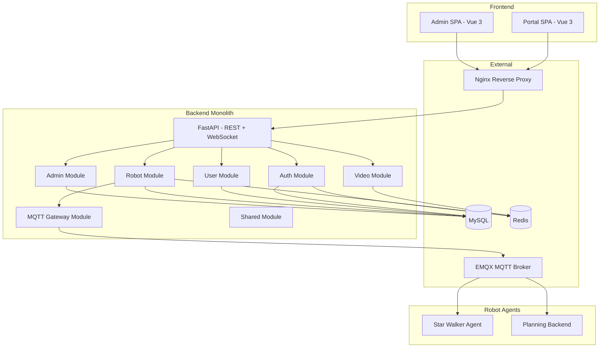

# Architecture Decision Record: RoboEase Refactor

## Context
The RoboEase platform is a robotic agent system with a Vue 3 frontend (portal + admin), a FastAPI backend, and Docker-based deployment. The codebase is structured into frontend, backend, docker, and artifacts directories. The backend source code is not available in the workspace; only Dockerfiles and docker-compose files were provided. The robot agent code is also unavailable. The shared workspace package `@roboease/shared` has not been explored.

## Decision
Adopt a **Modular Monolith** architecture for the backend, with clear module boundaries aligned to domain capabilities. The frontend remains as two separate SPAs (portal and admin) communicating with the backend via REST API and WebSocket. The system will use a **Layered Architecture** within the backend (API layer, service layer, data access layer) with **Domain-Driven Design** tactical patterns for core robot management and control domains.

## Rationale
- The team size is small (likely <10 developers), making a monolith practical.
- Domain boundaries are not yet fully understood; a modular monolith allows incremental extraction of services later.
- Rapid iteration is a priority; a monolith reduces operational complexity.
- The existing docker-compose shows a single backend service; splitting prematurely would add overhead.
- The backend is FastAPI-based, which supports modular organization via APIRouter.

## Alternatives Considered
1. **Microservices**: Rejected due to team size, unclear domain boundaries, and increased operational complexity. The current codebase does not exhibit independent scaling needs.
2. **Serverless (AWS Lambda)**: Rejected because the system includes long-running WebSocket connections for video streaming and robot control, which are not well-suited to Lambda.
3. **Event-Driven Architecture with Message Queue**: Considered but deferred; MQTT is already used for robot communication, but internal service communication can remain synchronous REST for now.

## Consequences
- Positive: Simpler deployment, easier debugging, faster development velocity.
- Positive: Clear module boundaries will facilitate future extraction of services if needed.
- Negative: The monolith may become large; disciplined modularization is required to avoid tight coupling.
- Negative: Scaling requires scaling the entire backend; but this is acceptable for current scale.

## Downstream Constraints
- The backend must be organized into modules: `auth`, `user`, `robot`, `video`, `mqtt`, `admin`, `shared`.
- Each module should have its own API router, service layer, and data access layer.
- The `@roboease/shared` package should contain DTOs, enums, and utility functions shared between frontend and backend.
- Robot agents communicate via MQTT; the backend must expose a unified MQTT gateway.
- Video streaming uses WebSocket on port 8765; this should be encapsulated in a dedicated `video` module.

## Architecture Diagram



## Data Flows
1. **Authentication**: User credentials -> Portal/Admin -> Nginx -> Backend Auth Module -> JWT token -> stored in cookie/localStorage.
2. **Robot Control**: Frontend -> Backend Robot Module -> MQTT Gateway -> EMQX -> Robot Agent.
3. **Video Streaming**: Robot Camera -> Backend Video Module (WebSocket) -> Frontend.
4. **Admin Operations**: Admin SPA -> Backend Admin Module -> MySQL.

## Failure Modes
- **Backend down**: Frontend shows error state; no API calls succeed.
- **MySQL down**: Auth, user, robot, admin operations fail; video streaming may still work if it uses Redis.
- **Redis down**: Caching and session management fail; system degrades but may still function.
- **EMQX down**: Robot control commands cannot be sent; video streaming unaffected.
- **Robot agent down**: Individual robot becomes unresponsive; other robots unaffected.

## Completion Report

```yaml
completion_report:
  what_was_done: Designed the target architecture for RoboEase refactor, producing an ADR with modular monolith decision, module boundaries, data flows, and failure modes.
  key_decisions:
    - decision: Adopt Modular Monolith for backend.
      rationale: Team size, unclear domain boundaries, rapid iteration priority.
    - decision: Use Layered Architecture with DDD tactical patterns.
      rationale: FastAPI supports modular organization; DDD helps manage complexity.
    - decision: Keep frontend as two separate SPAs.
      rationale: Existing structure works; no need to merge.
  handoff_focus:
    - Backend module structure and API contracts.
    - Shared package contents and usage.
    - MQTT gateway design for robot communication.
    - Video streaming module design.
  open_questions:
    - What is the exact backend source code structure? (needs exploration)
    - What does @roboease/shared contain? (needs exploration)
    - How are robot agents implemented? (needs exploration)
  known_constraints:
    - Backend source code not available in workspace.
    - Robot agent code not available.
    - Shared package not explored.
  confidence_differential: 0.7
  dissent_if_alone: null
  iteration_context: null
```