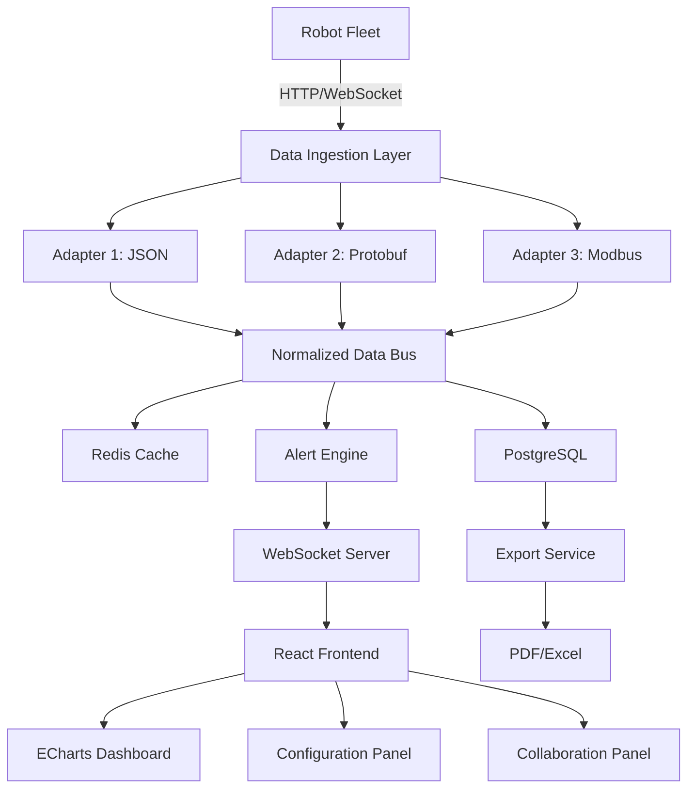

# Architecture Decision Record: Robot Fleet Monitoring Dashboard

## Context
We need to build a real-time monitoring dashboard for a fleet of robots. The system must ingest data from heterogeneous robot protocols (JSON, Protobuf, Modbus), normalize it, display real-time metrics and historical trends, detect anomalies, support team collaboration, and allow configuration. Initial scale: 10 robots, with horizontal scalability. Data retention: 30 days.

## Decision 1: Data Normalization via Adapter Pattern
- **Decision**: Use the Adapter pattern to normalize incoming robot data into a unified internal schema.
- **Rationale**: Each robot brand/protocol emits data in different formats. Adapters encapsulate protocol-specific parsing and produce a common schema. This allows adding new robot types without modifying core logic.
- **Alternatives Rejected**:
  - Centralized parser with if-else chains: Hard to maintain and extend.
  - Schema-on-read (e.g., store raw JSON and query with JSON paths): Loses type safety and performance.
- **Consequences**: Each new robot type requires a new adapter class. Adapters must be registered at startup.

## Decision 2: Backend Stack – Node.js + Express + WebSocket + PostgreSQL + Redis
- **Decision**: Use Node.js with Express for REST API, WebSocket for real-time push, PostgreSQL for historical data, Redis for caching latest state.
- **Rationale**: Node.js is well-suited for I/O-bound real-time applications. Express is mature and simple. WebSocket enables low-latency updates. PostgreSQL provides reliable relational storage with JSONB support for flexible schema parts. Redis offers fast in-memory caching for current robot states.
- **Alternatives Rejected**:
  - Python + Django + Channels: Good but team has more Node.js expertise.
  - Go + gRPC: Better performance but higher complexity for initial scale.
  - MongoDB: Schema flexibility not needed; relational queries for trends are easier in SQL.
- **Consequences**: Must manage WebSocket connections and Redis cache invalidation. PostgreSQL schema must be designed for time-series queries.

## Decision 3: Frontend Stack – React + TypeScript + ECharts + react-grid-layout + react-i18next
- **Decision**: Use React with TypeScript for UI, ECharts for charts, react-grid-layout for draggable layout, react-i18next for internationalization.
- **Rationale**: React is widely used and component-based. TypeScript adds type safety. ECharts provides rich interactive charts. react-grid-layout enables user-customizable dashboards. react-i18next is standard for i18n.
- **Alternatives Rejected**:
  - D3.js: More flexible but steeper learning curve and slower development.
  - Chart.js: Simpler but less feature-rich for complex charts like heatmaps.
  - Redux: Not needed; React context + WebSocket hooks suffice for this scale.
- **Consequences**: Bundle size may increase due to ECharts; code-splitting recommended.

## Decision 4: Alert Engine – Rule-Based with Configurable Thresholds
- **Decision**: Implement a rule engine that evaluates incoming normalized data against configurable thresholds (e.g., battery < 20%, joint temperature > 80°C, robot tilted > 45 degrees).
- **Rationale**: Simple, predictable, and easy to configure via UI. Rules are evaluated in-memory per data point.
- **Alternatives Rejected**:
  - Machine learning anomaly detection: Overkill for initial requirements; adds complexity.
  - Complex event processing (CEP) engine: Too heavy for 10 robots.
- **Consequences**: Alert rules are stored in PostgreSQL and cached in Redis. Alert history is persisted.

## Decision 5: Collaboration – WebSocket-Based Real-Time Messaging
- **Decision**: Use WebSocket for real-time collaboration features: comments, @mentions, and status markers.
- **Rationale**: WebSocket already exists for data push; reusing it for messaging reduces infrastructure.
- **Alternatives Rejected**:
  - Separate chat service (e.g., Firebase): Adds external dependency and latency.
  - Polling: Inefficient for real-time.
- **Consequences**: Must handle message persistence and ordering. @mentions require parsing and notification.

## Decision 6: Export – Server-Side PDF (Puppeteer) and Excel (exceljs)
- **Decision**: Generate PDF reports via Puppeteer (headless Chrome) and Excel via exceljs on the server.
- **Rationale**: Puppeteer can render the same dashboard views to PDF. exceljs is straightforward for spreadsheet export.
- **Alternatives Rejected**:
  - Client-side PDF generation (jsPDF): Less accurate for complex layouts.
  - CSV: Simpler but less user-friendly for reports.
- **Consequences**: Puppeteer requires Chrome binary; may increase deployment size.

## Decision 7: Theme and i18n – CSS Variables and react-i18next
- **Decision**: Use CSS custom properties for dark/light theme switching and react-i18next for multi-language support (Chinese/English).
- **Rationale**: CSS variables allow runtime theme switching without reload. react-i18next is standard and integrates well.
- **Alternatives Rejected**:
  - CSS-in-JS with theme provider: Works but adds runtime overhead.
  - Redux for theme state: Overkill; React context is sufficient.
- **Consequences**: All colors must be defined as CSS variables. i18n resource files must be maintained.

## System Architecture Overview



## Data Flow
1. Robots send telemetry via HTTP POST or WebSocket connection.
2. Ingestion layer routes data to appropriate adapter based on robot type.
3. Adapter parses and normalizes to unified schema.
4. Normalized data is:
   - Stored in PostgreSQL (time-series table).
   - Cached in Redis (latest state).
   - Evaluated by alert engine.
5. Alert engine triggers alerts if thresholds exceeded.
6. WebSocket server pushes updates (new data, alerts, collaboration messages) to frontend.
7. Frontend renders charts, updates dashboard, displays alerts.
8. User actions (config changes, collaboration messages) are sent via REST or WebSocket.

## Failure Modes
- **Robot disconnection**: System marks robot as offline after timeout; alert triggered.
- **PostgreSQL down**: Redis still serves latest state; historical queries fail; alerts may be delayed.
- **Redis down**: System falls back to PostgreSQL for latest state; performance degrades.
- **WebSocket server down**: Clients fall back to polling REST API for updates.

## Incremental Implementation Plan
1. **Phase 1**: Data ingestion + normalization + PostgreSQL storage + basic REST API.
2. **Phase 2**: WebSocket push + Redis caching + real-time dashboard with ECharts.
3. **Phase 3**: Alert engine + configuration panel.
4. **Phase 4**: Collaboration features + export.
5. **Phase 5**: Theme, i18n, draggable layout.

## Completion Report

```yaml
completion_report:
  what_was_done: Designed system architecture for Robot Fleet Monitoring Dashboard, including data normalization, backend/frontend stacks, alert engine, collaboration, export, theme/i18n. Documented ADR with decisions, rationale, alternatives, and consequences.
  key_decisions:
    - decision: Data normalization via Adapter pattern
      rationale: Encapsulate protocol-specific parsing; easy to extend.
    - decision: Backend Node.js + Express + WebSocket + PostgreSQL + Redis
      rationale: Real-time I/O, team expertise, relational storage for trends.
    - decision: Frontend React + TypeScript + ECharts + react-grid-layout + react-i18next
      rationale: Rich charts, customizable layout, i18n support.
    - decision: Alert engine rule-based with configurable thresholds
      rationale: Simple, predictable, sufficient for initial scale.
    - decision: Collaboration via WebSocket
      rationale: Reuse existing WebSocket infrastructure.
    - decision: Export via Puppeteer and exceljs
      rationale: Accurate PDF rendering and straightforward Excel generation.
    - decision: Theme via CSS variables, i18n via react-i18next
      rationale: Runtime switching without reload, standard library.
  handoff_focus:
    - Implement data ingestion adapters for JSON, Protobuf, Modbus.
    - Set up PostgreSQL schema for time-series data.
    - Implement WebSocket server for real-time push.
    - Build React dashboard with ECharts components.
    - Implement alert rule engine and configuration API.
  open_questions:
    - Alert notification channels beyond in-app (email/SMS)?
    - Role-based access control requirements?
    - Maximum robot scale beyond 10?
  known_constraints:
    - Initial 10 robots, horizontal scaling needed.
    - Data retention 30 days.
    - Must support dark/light theme, Chinese/English, draggable layout.
  confidence_differential: 0.85
  dissent_if_alone: null
  iteration_context: null
```

## Context Compression Report

```yaml
context_compression_report:
  input_scope:
    artifacts_read:
      - to-prd-prd-v1
    handoffs_read:
      - handoffs/to-prd→architect-20260530-165541.yaml
  retained_context:
    decisions:
      - statement: Use Adapter pattern for data normalization
        source: architect
        impact: Affects data ingestion layer design.
      - statement: Backend Node.js + Express + WebSocket + PostgreSQL + Redis
        source: architect
        impact: Affects technology stack and deployment.
      - statement: Frontend React + TypeScript + ECharts + react-grid-layout + react-i18next
        source: architect
        impact: Affects frontend implementation.
      - statement: Alert engine rule-based with configurable thresholds
        source: architect
        impact: Affects alerting subsystem.
      - statement: Collaboration via WebSocket
        source: architect
        impact: Affects real-time messaging design.
      - statement: Export via Puppeteer and exceljs
        source: architect
        impact: Affects export service.
      - statement: Theme via CSS variables, i18n via react-i18next
        source: architect
        impact: Affects frontend styling and localization.
    constraints:
      - statement: Initial support for 10 robots
        source: PRD
        impact: Scales architecture for horizontal growth.
      - statement: Data format unification required
        source: PRD
        impact: Adapter pattern mandatory.
      - statement: Support dark/light theme, multi-language, draggable layout
        source: PRD
        impact: Frontend must implement these features.
      - statement: Data retention 30 days
        source: PRD
        impact: PostgreSQL schema and cleanup jobs.
    assumptions:
      - statement: Robots report via HTTP/WebSocket
        source: PRD
        risk: May need to support other protocols.
      - statement: Ops team uses desktop browser
        source: PRD
        risk: Mobile responsiveness not critical.
      - statement: Alert notification only in-app initially
        source: PRD
        risk: May need email/SMS later.
    open_questions:
      - statement: Alert notification channels beyond in-app?
        source: architect
        owner: runtime
      - statement: Role-based access control needed?
        source: architect
        owner: runtime
      - statement: Maximum robot scale?
        source: architect
        owner: runtime
  omitted_context:
    - source: Specific file paths and code snippets
      reason: background_only
    - source: Third-party library versions
      reason: background_only
  compression_rationale:
    method: Retained all architectural decisions, constraints, and assumptions from PRD and handoff. Omitted implementation details that are not load-bearing.
    loss_notes:
      - Omitted specific file paths as they may change.
      - Omitted library versions; to be decided during development.
  quality_checks:
    - name: All structural decisions have stated rationale
      passed: true
    - name: Alternatives considered documented
      passed: true
    - name: Design can be implemented incrementally
      passed: true
    - name: Data flows explicit
      passed: true
    - name: Failure modes identified
      passed: true
```