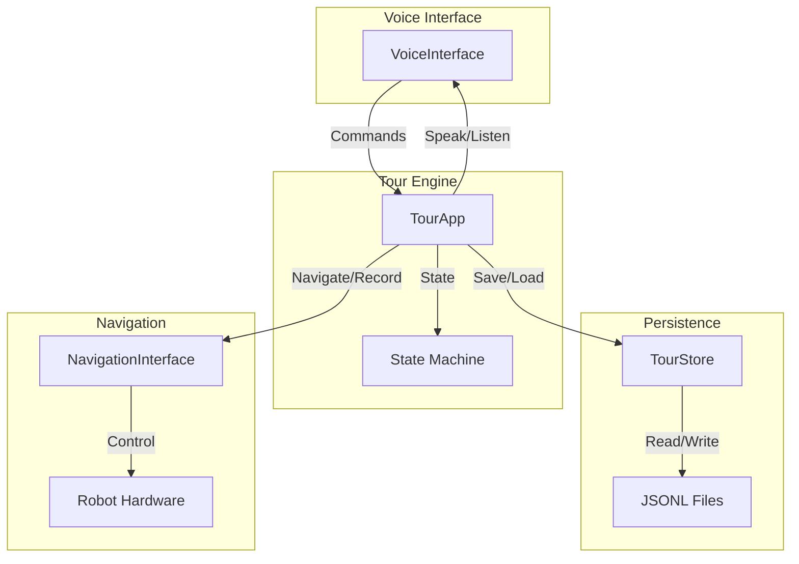

# Architecture Decision Record: Demonstration-Taught Guided Tour System

## Context
We need to build a demonstration-taught guided tour system for humanoid robots (Unitree G1, Agibot X2). The system has two modes: Teaching (operator walks robot through a path while speaking narration) and Guiding (robot autonomously replays the path with narration). The operator interface is voice-only (hands-free). The system must be resistant to hallucination — it must not generate waypoints or narration that were not recorded. Tours must persist across reboots.

## Decision
We will implement the tour system as a new application module under `pilot/apps/tour/` with four internal modules: `engine.py` (state machine), `store.py` (persistence), `voice.py` (voice interface), and `navigation.py` (robot navigation abstraction). The system will use a three-state state machine (IDLE, TEACHING, GUIDING) with explicit confirmation for state transitions. Persistence will use JSONL files in `~/.manastone/tours/`. Voice commands will be parsed against a fixed grammar; unrecognized utterances are rejected. The navigation interface will abstract robot-specific details, allowing the same code to work on both robot models.

## Rationale
- **Modular monolith**: The system is small (single developer team, well-understood domain). A modular monolith avoids microservice overhead while keeping clear boundaries for testability.
- **JSONL persistence**: Append-friendly, human-readable, easy to inspect and debug. No database dependency required for this scale.
- **Fixed grammar**: Prevents hallucination by rejecting any utterance that doesn't match the predefined command set. No NLP model is used for command interpretation.
- **Confirmation for transitions**: Reduces risk of accidental state changes in a voice-only interface.
- **Navigation abstraction**: Allows the same tour logic to work on both robot models without modification. Each robot provides its own implementation of the navigation interface.

## Alternatives Considered
1. **Microservices architecture**: Rejected because the system is small (single team, ~5 modules). Microservices would add deployment and operational complexity without benefit.
2. **SQLite for persistence**: Rejected because JSONL is simpler, append-friendly, and sufficient for the expected data volume (tours are small sequences of waypoints).
3. **Natural language command parsing**: Rejected because it introduces hallucination risk. Fixed grammar is more reliable for safety-critical voice control.
4. **Single state machine with more states**: Rejected because three states (IDLE, TEACHING, GUIDING) cover all required behaviors without unnecessary complexity.
5. **Shared database between robots**: Rejected because tours are robot-specific (pose data is relative to robot's odometry frame).

## Consequences
- **Positive**: Clear separation of concerns; easy to test each module in isolation; voice interface is predictable and safe; persistence is simple and debuggable.
- **Negative**: Fixed grammar limits expressiveness (operator must learn exact commands); JSONL may become slow for very large tour collections (unlikely); navigation abstraction requires each robot to implement the interface.
- **Risks**: Voice recognition accuracy depends on platform STT; navigation accuracy depends on robot odometry; audio file storage may grow large if narration clips are long.

## Data Flow
1. **Teaching**: Operator speaks command → VoiceInterface parses → TourApp records pose via NavigationInterface → TourApp records audio via VoiceInterface → TourApp stores (pose, audio_path) to TourStore.
2. **Guiding**: Operator speaks command → VoiceInterface parses → TourApp loads tour from TourStore → TourApp sends each pose to NavigationInterface for navigation → TourApp plays audio via VoiceInterface at each waypoint.
3. **Persistence**: TourStore reads/writes JSONL files in `~/.manastone/tours/`. Each tour is a JSON object with id, name, and list of waypoints (each with pose and audio_path).

## Failure Modes
- **Navigation failure during guiding**: Robot stops and waits, says "Navigation failed. Waiting for instruction." Operator can abort or retry.
- **Voice recognition failure**: System says "I didn't understand that." and remains in current state.
- **Audio file corruption**: System skips narration for that waypoint and continues.
- **Tour store corruption**: System reports error and returns to IDLE.

## Downstream Constraints
- **Senior Engineer**: Must implement the four modules with the defined interfaces. Must ensure state machine transitions are atomic. Must implement confirmation flow.
- **API Designer**: Must define the exact command grammar and confirmation prompts. Must specify audio format and duration limits.
- **Database Engineer**: No database needed; persistence is file-based. Must ensure JSONL format is correct and atomic writes are used.

## Architecture Diagram


## Completion Report

```yaml
completion_report:
  what_was_done: Designed architecture for demonstration-taught guided tour system, including module decomposition, state machine, data flow, persistence strategy, and failure modes.
  key_decisions:
    - decision: Modular monolith with four internal modules (engine, store, voice, navigation)
      rationale: Appropriate scale for single-developer team; clear boundaries for testability.
    - decision: Three-state state machine (IDLE, TEACHING, GUIDING) with confirmation
      rationale: Covers all required behaviors; confirmation prevents accidental transitions.
    - decision: JSONL file persistence in ~/.manastone/tours/
      rationale: Simple, append-friendly, human-readable; no database dependency.
    - decision: Fixed grammar for voice commands
      rationale: Prevents hallucination; predictable and safe.
    - decision: Navigation interface abstraction
      rationale: Supports both Unitree G1 and Agibot X2 without code duplication.
  handoff_focus:
    - Implement TourApp state machine with confirmation flow
    - Implement TourStore with JSONL read/write
    - Implement VoiceInterface with fixed grammar parsing
    - Implement NavigationInterface for each robot model
  open_questions:
    - What specific STT/TTS engine will be used? (macOS built-in, cloud API, etc.)
    - How is audio narration stored? (file path, format, duration limits?)
    - What is the maximum number of waypoints per tour?
    - How does the robot handle navigation failure during guiding? (stop and wait, retry, abort?)
  known_constraints:
    - Must work on Unitree G1 and Agibot X2 robots
    - Voice-only interface, no GUI
    - Must not hallucinate waypoints or narration
    - Must persist tours across reboots
  confidence_differential: 0.85
  dissent_if_alone: null
  iteration_context: null
```
